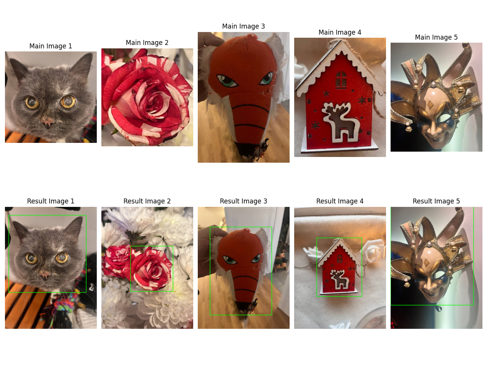

## ORB
### 1. **Ключевые точки на обоих изображениях**
В коде:
```python
queryKeypoints, queryDescriptors = orb.detectAndCompute(main_bw, None)
trainKeypoints, trainDescriptors = orb.detectAndCompute(example_bw, None)
```

### 2.  **FAST**:
Ключевая точка определяется на основе изменения интенсивностей на окружности радиуса \( r \) вокруг точки \( I_p \).

## **Условие ключевой точки:**


где:
- \( I_p \) — интенсивность центрального пикселя,
- \( I_i \) — интенсивности пикселей на окружности,
- \( t \) — пороговое значение.

## **Фильтрация ключевой точки: **
Формируется матрица автокорреляции A (матрица второго момента)


Мера Харриса: 
, 
альфа - константа
---
### 3. **BRIEF для бинарных дескрипторов**
**BRIEF — бинаризация патча вокруг ключевой точки:**
Для двух точек \( x \) и \( y \) в патче:


Здесь \( p(x) \) и \( p(y) \) — интенсивности пикселей \( x \) и \( y \).

---
### 4. **Сопоставление ключевых точек используется рассстояние **Хамминга****
В коде:
```python
matcher = cv2.BFMatcher()
matches = matcher.match(queryDescriptors, trainDescriptors)
```

 для сравнения бинарных дескрипторов:
---
### 5. **Визуализация совпаденийри при помощи гомографии**
Гомография позволяет связать эталонное изображение и тестовое, позволяя учитывать разное пространственное расположение объектов. 
Гомография - матрица размером 3x3, которая переводит точки (x1,y1) одного изображения в (x2,y2) другого.


H - матрица гомографии.
---
### 6. **Изменение перспективы**
Далее матрица гомографии используется для изменения перспективы, чтобы одно изображение совпало с другим.

p2 = H * p1, где 
p1 - координаты точки на исходном изображении, p2 - точки на новом изображении.
---
**Визуализация результатов:**




---
## Используемые источники

| №  | Источник                                                                                 | Описание                                   |
|----|------------------------------------------------------------------------------------------|-------------------------------------------|
| 1  | [Формулы и объяснение ORB](https://medium.com/@imhongxiaohui/explanation-of-orb-in-point-feature-extraction-1cdd9b82655a)       | Принцип работы алгоритма |
| 2  | [Статья про ORB](https://habr.com/ru/articles/414459/) | Принцип работы алгоритма    |
| 3  | [Гомография](https://waksoft.susu.ru/2020/03/26/primery-gomogrfii-s-ispolzovaniem-opencv/) | Гомография |


