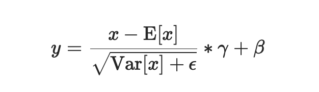
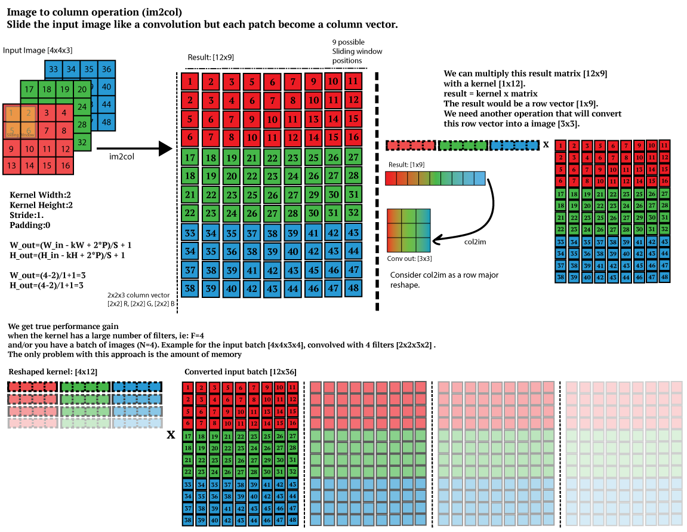
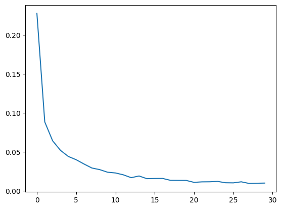
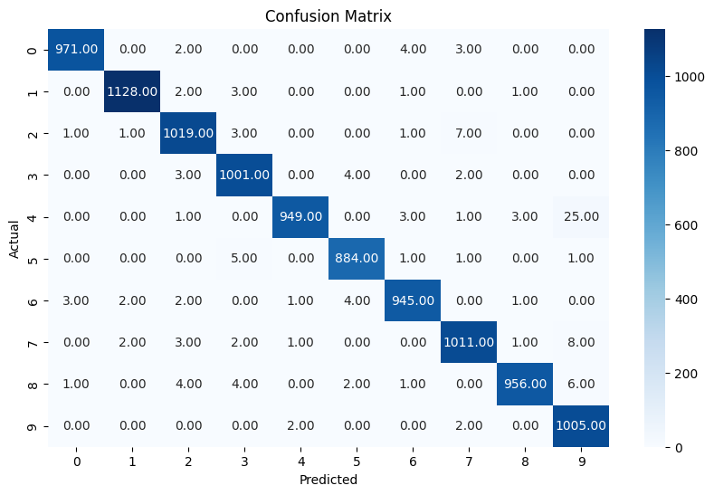
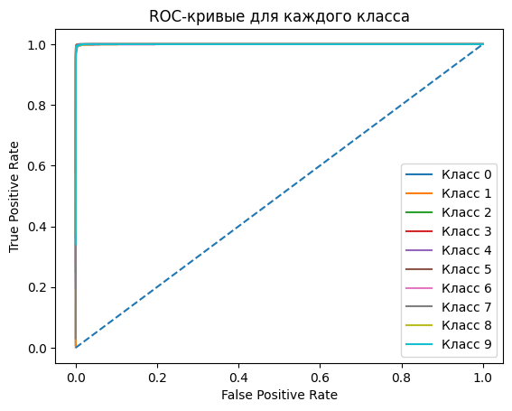

# Convolutional Neural Networks

## Основные части архитектуры CNN
### 1. Входной слой (Input Layer)
Представляет исходные данные сети – чаще всего это изображения в форме тензора размером `(высота, ширина, количество каналов)`. Например, цветное изображение может иметь размер `32 x 32 x 3`, где `3` – число цветовых каналов (RGB).
- **Пример**: Для набора данных MNIST, вход – это изображение рукописной цифры размером `28 x 28 x 1`.  
- **Особенность**: На этом этапе сеть не производит вычислений, а лишь принимает данные и готовит их к дальнейшим преобразованиям.

### 2. Сверточные слои (Convolutional Layers)
Вместо того чтобы напрямую работать со всем входным изображением, сверточный слой применяет набор фильтров (ядер свертки) ограниченного размера. Каждый такой фильтр проходит по изображению, вычисляя свертку своих весовых коэффициентов с соответствующим фрагментом входа.
- **Выделение признаков**:  
  - На ранних слоях фильтры могут обучаться находить простейшие признаки: контуры, горизонтальные или вертикальные линии, простые текстуры.  
  - На более глубоких слоях CNN уже обрабатывают сформированные ранее признаки, распознавая более сложные структуры, такие как части объектов или даже целые объекты.
- **Параметры**:  
  - **Число фильтров**: Определяет глубину выхода сверточного слоя. Чем больше фильтров, тем больше признаков извлекается.  
  - **Размер фильтра**: Определяет область восприятия фильтра. Меньшие фильтры (например, `3x3`) стали промышленным стандартом благодаря своей эффективности.
  - **Шаг (stride)**: Определяет, с каким шагом фильтр смещается по входному изображению. Большее значение шага уменьшает размер выходной карты признаков.
  - **Заполнение (padding)**: Может быть "valid" (без заполнения) или "same" (с заполнением нулями по краям), позволяя контролировать размеры выходных карт признаков.
- **Выходные данные**: Результат свертки каждого фильтра с входом формирует так называемые «карты признаков» . В совокупности они образуют многоканальный выход сверточного слоя.

### 3. Функция активации (Activation Function)
Применяется к выходу сверточного слоя, чтобы придать модели способность к нелинейному отображению данных. Без нелинейности сеть свелась бы к простой линейной модели.
- **Функции**:  
  - **ReLU (Rectified Linear Unit)**: `f(x) = max(0, x)` – простая функция, обнуляющая отрицательные значения и оставляющая положительные без изменений. Эта функция ускоряет сходимость сети и решает проблему исчезающего градиента.  
  - **Вариации ReLU**: Leaky ReLU, ELU, GELU, которые могут улучшить обучение в некоторых задачах.
- **Результат применения**: После активации выход карты признаков становится нелинейным представлением входа, способствующим более гибкому обучению.

### 4. Слои подвыборки (Pooling Layers)
Уменьшают пространственное разрешение карты признаков, сохраняя наиболее важную информацию. Это упрощает модель, снижает количество параметров и делает извлеченные признаки более устойчивыми к небольшим трансформациям входных данных.
- **Виды**:  
  - **Max Pooling**: Выбирает максимальное значение в окне заданного размера (обычно `2x2`) с определенным шагом.  
  - **Average Pooling**: Вычисляет среднее значение внутри окна.
- **Результат применения**: Карта признаков уменьшается по размеру, что помогает сократить вычислительную нагрузку, ускорить обучение и уменьшить риск переобучения.

### 5. Полносвязные слои (Fully Connected Layers)
После нескольких чередующихся сверточных и пуллинговых слоев, результирующие признаки, уже детализированно извлеченные из входных данных, подаются в один или несколько полносвязных слоев.
- **Как работает**:  
  - Каждый нейрон полносвязного слоя соединен со всеми входными признаками, что позволяет объединить всю ранее выделенную информацию для принятия решения.  
  - Эти слои часто располагаются перед выходным слоем и работают как классические персептроны.
- **Функция в классификации**: Если задача – классификация, последний полносвязный слой преобразует признаки в вектор, длина которого равна количеству классов. Чаще всего над этим выходом применяется функция активации softmax, чтобы получить распределение вероятностей по классам.


### 5. Дополнительно: Нормализация батчей (Batch Normalization) 
Это слой, который нормализует входные данные по мини-батчу, вычитая среднее и деля на стандартное отклонение. 
- **Как работает**: 
После свертки и активации (или до активации, в зависимости от архитектуры), BatchNorm масштабирует и смещает данные, чтобы поддерживать стабильное распределение активаций.



--- 
## Making faster
### im2col and col2im 


ссылка: https://leonardoaraujosantos.gitbook.io/artificial-inteligence/machine_learning/deep_learning/convolution_layer/making_faster

Данная часть реализована 3 оснвоными функциями: 
- **get_indices** - реализует получение всех индекосов итоговой матрицы преобразования 
-  **col2im** - длеате обратное преобразование матрицу в изображение
-  **im2col** - преобразует все изображеия в матрицу преобразования 

```python 
def get_indices(X_shape, HF, WF, stride, pad):
    # X_shape: (m, n_C, n_H, n_W) - размеры входного тензора
    # HF: высота фильтра (kernel height)
    # WF: ширина фильтра (kernel width)
    # stride: шаг свертки
    # pad: количество дополнений (padding)

    # Извлечение размеров входного тензора
    m, n_C, n_H, n_W = X_shape

    # Вычисление размеров выходной карты признаков
    out_h = int((n_H + 2 * pad - HF) / stride) + 1  # высота выходного тензора
    out_w = int((n_W + 2 * pad - WF) / stride) + 1  # ширина выходного тензора

    # Создание базовых позиций фильтра по высоте (повторяем HF раз по ширине фильтра WF)
    level1 = np.repeat(np.arange(HF), WF)
    level1 = np.tile(level1, n_C)  # Повторяем для каждого канала

    # Сдвиги по высоте с учётом шага свертки
    everyLevels = stride * np.repeat(np.arange(out_h), out_w)  # Повторяем индексы высоты для каждой ширины

    # Суммируем базовые индексы и сдвиги для получения всех позиций по высоте
    i = level1.reshape(-1, 1) + everyLevels.reshape(1, -1)

    # Создание базовых позиций фильтра по ширине
    slide1 = np.tile(np.arange(WF), HF)  # Повторяем индексы ширины WF для высоты HF
    slide1 = np.tile(slide1, n_C)  # Повторяем для каждого канала

    # Сдвиги по ширине с учётом шага свертки
    everySlides = stride * np.tile(np.arange(out_w), out_h)  # Повторяем индексы ширины для каждой высоты

    # Суммируем базовые индексы и сдвиги для получения всех позиций по ширине
    j = slide1.reshape(-1, 1) + everySlides.reshape(1, -1)

    # Создание индексов каналов
    d = np.repeat(np.arange(n_C), HF * WF).reshape(-1, 1)  # Повторяем каждый канал HF*WF раз

    return i, j, d


def im2col(X, HF, WF, stride, pad):
    # X: входной тензор (массив), форма (m, n_C, n_H, n_W)
    # HF: высота фильтра
    # WF: ширина фильтра
    # stride: шаг свертки
    # pad: дополнение нулями (padding)

    # Дополнение входного тензора нулями (padding)
    X_padded = np.pad(X, ((0,0), (0,0), (pad, pad), (pad, pad)), mode='constant')

    # Генерация индексов для развёртывания тензора
    i, j, d = get_indices(X.shape, HF, WF, stride, pad)

    # Извлечение значений из дополнённого тензора на основе индексов
    cols = X_padded[:, d, i, j]  # Выбор значений из X_padded по сгенерированным индексам

    # Объединение всех окон в плоский массив
    cols = np.concatenate(cols, axis=-1)  # Конкатенация по последней оси

    # Возвращаем плоский массив (развёрнутый тензор)
    return cols 

def col2im(dX_col, X_shape, HF, WF, stride, pad):
    # dX_col: градиенты в плоской форме (результат свертки)
    # X_shape: форма исходного входного тензора (m, n_C, n_H, n_W)
    # HF: высота фильтра
    # WF: ширина фильтра
    # stride: шаг свертки
    # pad: дополнение нулями

    # Извлечение размеров исходного тензора
    N, D, H, W = X_shape
    H_padded, W_padded = H + 2 * pad, W + 2 * pad  # Размеры дополненного тензора

    # Создание пустого дополнённого тензора для градиентов
    X_padded = np.zeros((N, D, H_padded, W_padded))

    # Генерация индексов для развёртывания
    i, j, d = get_indices(X_shape, HF, WF, stride, pad)

    # Разделение плоского массива на отдельные примеры
    dX_col_reshaped = np.array(np.hsplit(dX_col, N))

    # Заполнение дополнённого градиентного тензора по индексам
    np.add.at(X_padded, (slice(None), d, i, j), dX_col_reshaped)

    # Убираем дополнение, если оно было
    if pad == 0:
        return X_padded  # Если паддинга нет, возвращаем весь массив
    elif type(pad) is int:
        return X_padded[:, :, pad:-pad, pad:-pad]  # Убираем паддинг по высоте и ширине

```
---
## Итоги 
Данный код применялся для обучения сверточной нейронной сети для определения цифр на изображениях Mnist. 

### Loss - **Категориальная кросс энтропия**

```python
def categorical_cross_entropy(y_pred, y_true):
    y_pred = np.clip(y_pred, 1e-15, 1 - 1e-15)
    return -np.sum(y_true * np.log(y_pred))
```

### График Loss, Confusion matrix, Roc



